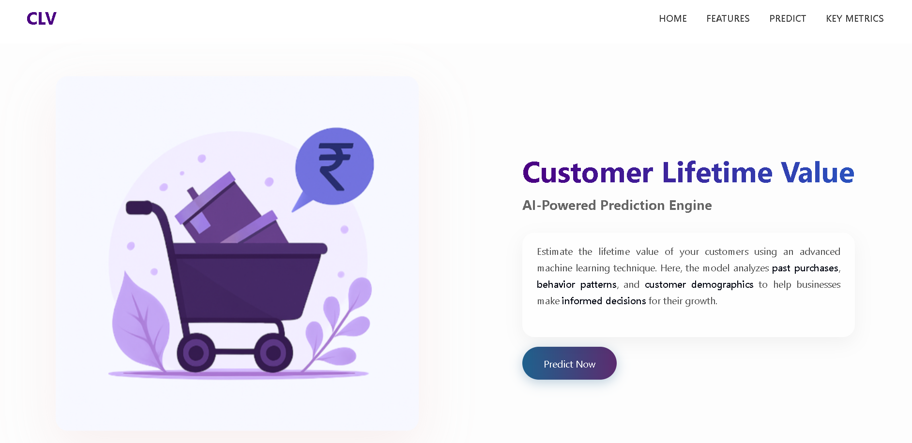
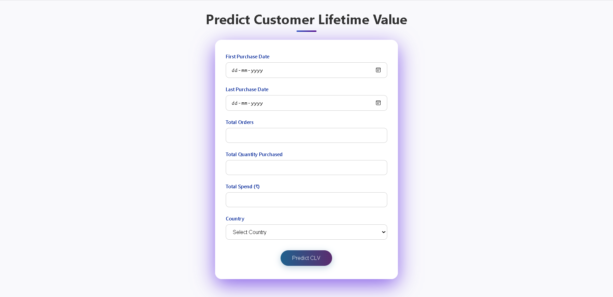
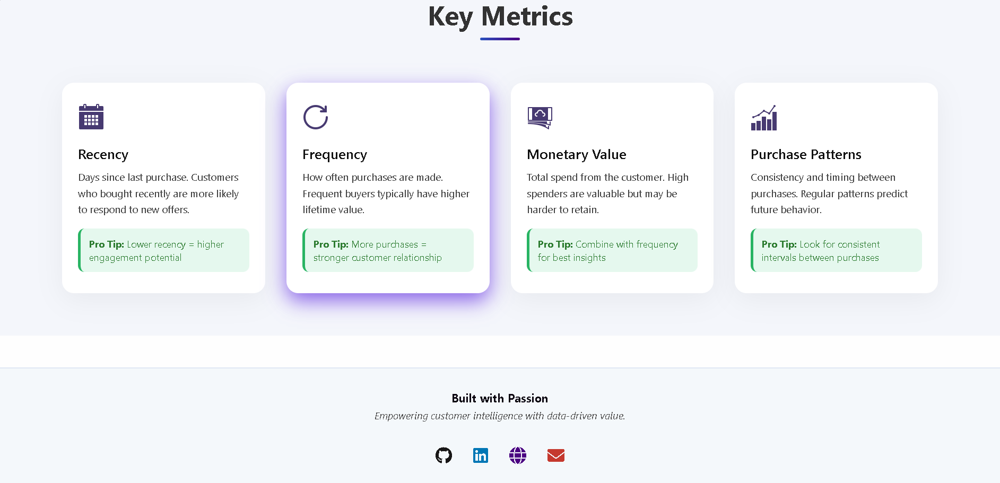

# Customer Lifetime Value Predictor

An AI-powered web application that helps businesses estimate the potential lifetime value of a customer based on purchase history, frequency, and behavioral patterns.



## Features

- Predict customer CLV using machine learning (XGBoost)
- Input form to enter transactional data
- Visualize key customer metrics like Recency, Frequency, Spend
- Responsive and modern UI built with HTML, CSS, and JavaScript

### CLV Prediction Form


- Interactive form and real-time prediction results

### Key Metrics Explained

- **Recency**: Days since last purchase  
- **Frequency**: Number of purchases made  
- **Monetary Value**: Total spend etc...



### Tech Stack

- **Frontend**: HTML, CSS, JavaScript  
- **Backend**: Flask (Python)
- **Model**: XGBoost (trained on Online Retail dataset)

## Getting Started

### 1. Clone the Repository

```bash
git clone https://github.com/aamir-10/CustomerLifetimeValuePredictor.git
cd CustomerLifetimeValuePredictor
```

### 2. Setup Environment

```bash
pip install -r requirements.txt
```

### 3. Run the App

```bash
python app.py
```

## Deployment

This app can be deployed on platforms like **Render** using Gunicorn.

### Start Command (for production)
```
gunicorn app:app
```

## Live Demo

Try the live app here: [CLV Predictor Live](https://clv-predictor.onrender.com/)

---
